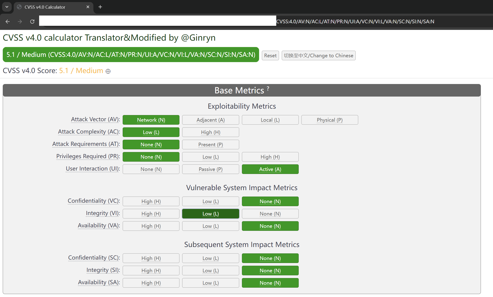
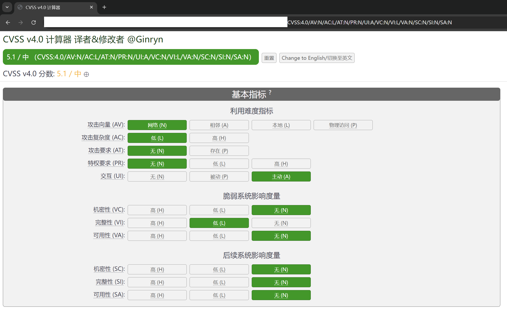

# CVSS v4.0 calculator
*EN DOCUMENTATION*
## Release Notes

* Added Chinese translation.
* Merged Chinese and English into one project, switchable via a button.
* Modified the quick paste section to show scores/levels (CVSS version/vector).


## Docker部署

### Command
```shell
docker build -t cvss-v4-calculator:2024070201.0 .
docker run -d -p 6699:6686 cvss-v4-calculator:2024070201.0
```
### Dockerfile
```dockerfile
# dockerfile
FROM nginx:latest
COPY . /usr/share/nginx/html
COPY default_nginx.conf /etc/nginx/conf.d/default.conf
RUN chmod 644 /usr/share/nginx/html/*
RUN chown -R nginx:nginx /usr/share/nginx/html
```
### Nginx config
```nginx
# default_nginx.conf
server {
    listen 8866;
    server_name _;

    root /usr/share/nginx/html;

    index index.html index.htm;

    access_log /var/log/nginx/access.log;
    error_log /var/log/nginx/error.log;

    location / {
        try_files $uri $uri/ =404;
    }

    location ~ /\. {
        deny all;
    }
}
```
***
***

*中文 文档*
# CVSS v4.0 计算器
## 版本说明
### 2024070201.0
* 添加了中文翻译；
* 合并中英文至一个项目中，通过按钮切换；
* 在快速粘贴处，修改成了分数/级别（CVSS版本/向量）；


## Docker部署

### Command
```shell
docker build -t cvss-v4-calculator:2024070201.0 .
docker run -d -p 6699:6686 cvss-v4-calculator:2024070201.0
```
### Dockerfile
```dockerfile
# dockerfile
FROM nginx:latest
COPY . /usr/share/nginx/html
COPY default_nginx.conf /etc/nginx/conf.d/default.conf
RUN chmod 644 /usr/share/nginx/html/*
RUN chown -R nginx:nginx /usr/share/nginx/html
```
### Nginx config
```nginx
# default_nginx.conf
server {
    listen 8866; # 修改为8866端口
    server_name _;

    # 根目录设置为容器内HTML文件所在目录
    root /usr/share/nginx/html;

    # 默认首页文件
    index index.html index.htm;

    # 日志配置
    access_log /var/log/nginx/access.log;
    error_log /var/log/nginx/error.log;

    # 静态文件处理
    location / {
        try_files $uri $uri/ =404;
    }

    # 禁止访问隐藏文件
    location ~ /\. {
        deny all;
    }
}
```